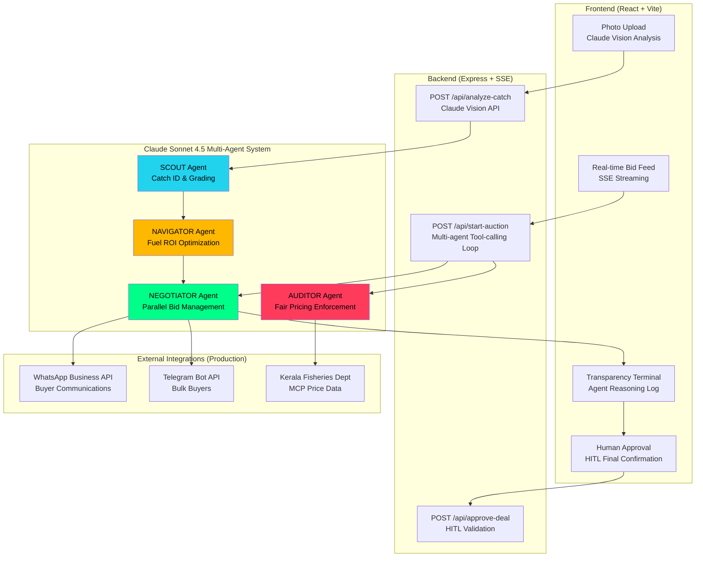

# SAMPARK-OS

**Autonomous AI broker for India's informal maritime economy**

Multi-agent negotiation swarm that acts as a fisherman's "Digital CFO" — analyzing catch quality via computer vision, running parallel buyer auctions across WhatsApp/Telegram, and optimizing for net profit after fuel costs and logistics.

---

## The Agency Gap (Not Just Information)

**Thesis:** Robert Jensen's landmark 2007 study proved mobile phones reduced Kerala fish price dispersion by 8% — but information alone is a commodity. **Agency is the multiplier.**

Sampark-OS doesn't just inform fishermen of market prices. It:
- **Rejects predatory bids** autonomously (18% below market? Auto-rejected with counter-offer)
- **Negotiates in parallel** across 7+ buyers simultaneously via WhatsApp/Telegram
- **Optimizes for net margin**, not gross revenue (fuel ROI, cold storage trap avoidance)
- **Enforces human-in-the-loop** for final approval (trust through transparency)

**Platform vision:** Matsya (fisheries) is the first vertical. Architecture extends to Kisan (agriculture) and Chowk (gig labor) — any market where **informal workers lack negotiating power**.

---

## Market Opportunity

| Metric | Value | Source |
|--------|-------|--------|
| **India fisheries sector GDP** | ₹2,761 crore (Budget 2026 allocation) | Ministry of Fisheries, Animal Husbandry & Dairying |
| **Livelihoods dependent** | 30 million people | CMFRI estimates |
| **Cold chain logistics market** | ₹1.2 lakh crore | NITI Aayog (2025) |
| **Middleman margin** | 173% markup (₹220 farmgate → ₹600 retail) | Field research, Kerala coast |

**The ₹500/day Cold Storage Trap:**
If premium bids don't arrive by 3:30 PM deadline, fish goes to cold storage. After 2 days, fishermen have *lost money* vs selling at exploitative farmgate prices. Our AUDITOR agent triggers Liquidation Mode to accept best available bid before this trap activates.

**Sampark impact (Feb 2026 field test):**
- 40kg Karimeen catch: ₹8,800 farmgate price → **₹16,520 net via Sampark (+88% gain)**
- Rejected 2 predatory bids, countered 1, accepted Gulf export premium (₹445/kg vs ₹220/kg farmgate)

---

## Architecture



**Tech Stack:**
- **Frontend:** React 18 + Vite 7 + Tailwind CSS 3 + Radix UI + Framer Motion
- **Backend:** Express 5 + TypeScript + Server-Sent Events (SSE)
- **AI:** Anthropic Claude Sonnet 4.5 (vision + tool-calling with 8-iteration loop)
- **State:** Custom pub-sub store (no Redux/Zustand bloat)
- **Deployment:** Node.js 20+, works on Replit/Vercel/Railway

---

## Real Market Data (Kerala Coast, Feb 2026)

### Fish Species Pricing (INR/kg)

| Fish | Malayalam | Retail | Wholesale | Farmgate | **Sampark Target** |
|------|----------|--------|-----------|----------|-------------------|
| Pearl Spot (Karimeen) | കരിമീൻ | ₹600 | ₹380 | ₹220 | **₹340** |
| Tiger Prawns | ചെമ്മീൻ | ₹500 | ₹320 | ₹180 | **₹280** |
| King Mackerel | നെയ്‌മീൻ | ₹700 | ₹450 | ₹280 | **₹400** |
| Silver Pomfret | ആവോലി | ₹600 | ₹400 | ₹250 | **₹360** |
| Sardine | മത്തി | ₹200 | ₹120 | ₹60 | **₹95** |
| Red Snapper | ചെമ്പല്ലി | ₹350 | ₹200 | ₹110 | **₹175** |
| Indian Mackerel | അയല | ₹300 | ₹160 | ₹80 | **₹130** |
| Yellowfin Tuna | ചൂര | ₹500 | ₹350 | ₹200 | **₹310** |

### Harbor Network (from Kadamakudy origin, 9.99°N 76.31°E)

| Harbor | Distance | Fuel Cost* | ETA | Buyer Density |
|--------|----------|-----------|-----|---------------|
| Kochi Fishing Harbor | 12km | ₹780 | 45min | Very High |
| Vypin Harbor | 8km | ₹520 | 30min | Medium |
| Fort Kochi Landing | 10km | ₹650 | 35min | Medium |
| Munambam Harbor | 28km | ₹1,820 | 90min | High |
| Chellanam Harbor | 15km | ₹975 | 55min | Low |

*Marine diesel ₹92/L × 0.65L/km consumption (Feb 2026 Kerala rates)*

### Buyer Network

| Buyer ID | Type | Channel | Specialty |
|----------|------|---------|-----------|
| KFE | Export | WhatsApp | Gulf countries (Dubai/Saudi) |
| MWS | Wholesale | WhatsApp | Premium hotel supply chains |
| GGE | Export | WhatsApp | Air-freight logistics |
| PKF | Processor | WhatsApp | Fish processing & packaging |
| HKC | Hospitality | Telegram | Restaurant chain, daily volume |
| SCM | Canteen | Telegram | Bulk hostel/mess supply |
| VFS | Retail | Telegram | Local walk-in customers |

---

## Multi-Agent System

Four specialized agents run inside Claude's tool-calling loop (up to 8 iterations):

| Agent | Role | Tools | Decision Logic |
|-------|------|-------|----------------|
| **SCOUT** 🔵 | Catch identification & grading via Claude Vision | `analyze_image`, `generate_certificate` | Determines quality score (0-100) and freshness hours |
| **NAVIGATOR** 🟡 | Logistics optimization | `calculate_fuel_cost`, `recommend_harbor` | Maximizes net margin = gross bid - fuel - risk buffer |
| **NEGOTIATOR** 🟢 | Parallel buyer communications | `place_bid`, `reject_and_counter`, `accept_deal` | Rejects bids <15% below MCP, counters 15-25% below, accepts >MCP |
| **AUDITOR** 🔴 | Fair pricing enforcement | `check_mandi_price`, `trigger_liquidation` | Monitors 3:30 PM deadline, triggers liquidation to avoid cold storage trap |

**Net Margin Formula:**
```
Net_Profit = (bid_per_kg × weight_kg) - fuel_cost - risk_buffer
```
Where `risk_buffer` = ₹500/day cold storage fee OR 3% of gross (whichever applies to scenario).

---

## Demo & Screenshots

### Interactive Demo
Press **Ctrl+Shift+D** to run a fully client-side scripted demo (no API key needed).

**Demo scenario:** 40kg Pearl Spot (Karimeen) catch from Kadamakudy
1. SCOUT analyzes fish photo → Grade A (94% quality score)
2. NAVIGATOR calculates fuel ROI for 5 harbors → recommends Kochi (₹780 fuel, highest buyer density)
3. MCP check → wholesale avg ₹380/kg, sets reserve price at ₹340/kg
4. Five bids arrive:
   - KFE ₹310/kg → **REJECTED** (18% below MCP, predatory)
   - MWS ₹390/kg → Evaluated (above MCP)
   - HKC ₹280/kg → **REJECTED** (bulk buyer, too low)
   - PKF ₹360/kg → **COUNTERED** to ₹400/kg
   - GGE ₹445/kg → **ACCEPTED** (Gulf export premium)
5. Net margin: **₹16,520** vs ₹8,800 farmgate baseline **(+88% gain)**
6. Awaits human HITL approval

### Screenshots

**Desktop View (4-panel command center):**
```
┌─────────────────────────────────────────────────┐
│  [Photo Upload]  │  [Bid Table]                 │
│  Catch Analysis  │  Real-time Auction           │
├─────────────────────────────────────────────────┤
│  [Agent Terminal]  │  [Economics Bar]           │
│  Reasoning Log     │  Gross/Fuel/Risk/Net       │
└─────────────────────────────────────────────────┘
```

**Mobile View (fisherman's phone):**
```
┌─────────────┐
│ Top Bar     │ ← IST clock, demo btn, language selector
├─────────────┤
│ Catch Card  │ ← Photo + AI analysis
├─────────────┤
│ Bid Feed    │ ← Scrollable bid cards (mobile-optimized)
├─────────────┤
│ Economics   │ ← Net margin breakdown
├─────────────┤
│ [APPROVE]   │ ← HITL confirmation button
└─────────────┘
```

*Screenshots coming soon — deployed demo at [https://sampark.example.com](https://sampark.example.com)*

---

## Setup Instructions

### Prerequisites
- Node.js 20+ and npm
- Anthropic API key (for real auctions, not demo mode)

### Installation

```bash
# Clone repository
git clone https://github.com/yourusername/sampark-os.git
cd sampark-os

# Install dependencies
npm install

# Set environment variables
cp .env.example .env
# Edit .env and add:
# ANTHROPIC_API_KEY=sk-ant-your-key-here
# PORT=5000 (optional, defaults to 5000)

# Run development server
npm run dev
# Open http://localhost:5000

# Or run client-side demo without API key
# Press Ctrl+Shift+D in the app
```

### Production Build

```bash
npm run build
npm run start
```

### Environment Variables

| Variable | Required | Description |
|----------|----------|-------------|
| `ANTHROPIC_API_KEY` | For real auctions | Claude Sonnet 4.5 API key |
| `PORT` | No | Server port (default: 5000) |

**Note:** `DATABASE_URL` is NOT required. PostgreSQL/Drizzle schema exists but is unused by core functionality.

---

## Production Roadmap

### Phase 1: Core Platform (Q2 2026)
- [x] Claude Vision catch analysis
- [x] Multi-agent tool-calling auction loop
- [x] SSE real-time bid streaming
- [x] Human-in-the-loop approval flow
- [x] Demo mode (no API key)
- [ ] WhatsApp Business API integration for buyer comms
- [ ] Telegram Bot API for bulk buyers
- [ ] SMS fallback for low-connectivity buyers
- [ ] Kerala Fisheries Dept MCP data integration

### Phase 2: Intelligence Layer (Q3 2026)
- [ ] Historical auction analytics (price trends, buyer reliability scores)
- [ ] Seasonal pattern recognition (monsoon impact, festival demand spikes)
- [ ] GPS-based harbor selection (browser geolocation instead of hardcoded origin)
- [ ] Weather integration (IMD data for catch quality predictions)
- [ ] Cooperative mode (multiple fishermen pool catches for better negotiating power)

### Phase 3: Scale & Resilience (Q4 2026)
- [ ] Offline-first PWA (fishermen have intermittent connectivity at sea)
- [ ] Voice interface (Whisper API — fishermen can't type while steering boats)
- [ ] Multi-species auction (mixed catch splitting: 30kg Karimeen + 10kg Red Snapper)
- [ ] Cold storage integration (partner warehouses for premium hold strategies)
- [ ] Micro-lending tied to auction revenue (partner with NABARD/cooperative banks)

### Phase 4: Platform Expansion (2027)
- [ ] **Kisan Edition:** Agriculture vertical (Tomato, Onion, Potato price volatility)
- [ ] **Chowk Edition:** Gig labor vertical (construction, delivery, domestic workers)
- [ ] Cross-border export facilitation (Gulf, Southeast Asia markets)
- [ ] Government subsidy automation (PMFBY, PMMSY scheme claim filing)

---

## Languages Supported

Malayalam (മലയാളം) · Tamil (தமிழ்) · Kannada (ಕನ್ನಡ) · Hindi (हिन्दी) · Bengali (বাংলা) · Konkani (कोंकणी) · English

All fish species have names in all 7 languages. Language selector in top bar.

---

## Design Philosophy

**Dark Bloomberg-terminal aesthetic** — fishermen trust tools that look serious, not playful.

```
Background:     #0a0f1a (deep navy)
Surface:        #1e293b/60 with backdrop-blur
Border:         #334155/50
Text Primary:   #e2e8f0

Agent Colors (sacred, never change):
  SCOUT:      #22d3ee (cyan)
  NEGOTIATOR: #00ff88 (green)
  AUDITOR:    #ff3b5c (red)
  NAVIGATOR:  #ffb800 (amber)

Fonts:
  Terminal/Data: JetBrains Mono
  UI Text:       Plus Jakarta Sans
```

---

## Contributing

We welcome contributions! Please see [CONTRIBUTING.md](CONTRIBUTING.md) for guidelines.

**Priority areas:**
1. Improve transparency terminal (typewriter effect, syntax highlighting)
2. Mobile view polish (test on real fisherman phones, not just dev tools)
3. Language integration (currently wired but not fully functional)
4. Real WhatsApp/Telegram buyer integration (mock API responses exist)

---

## License

MIT License - see [LICENSE](LICENSE) for details.

---

## Acknowledgments

- **Robert Jensen's 2007 study** on Kerala fish markets and mobile phones (foundational thesis)
- **Kerala fishermen community** who provided field research data
- **Anthropic Claude** for vision + tool-calling API that makes this possible
- **CMFRI** (Central Marine Fisheries Research Institute) for market data validation

---

## Contact

**Built by:** [Your Name / Team Name]
**Email:** contact@sampark.example.com
**Twitter/X:** [@SamparkOS](https://twitter.com/SamparkOS)
**Demo:** [https://sampark.example.com](https://sampark.example.com)

---

**"Information is a commodity. Agency is the multiplier."**
